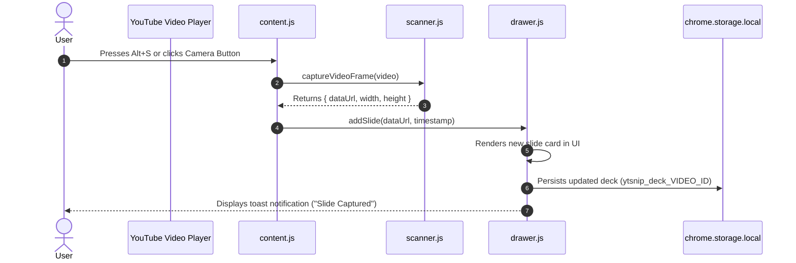
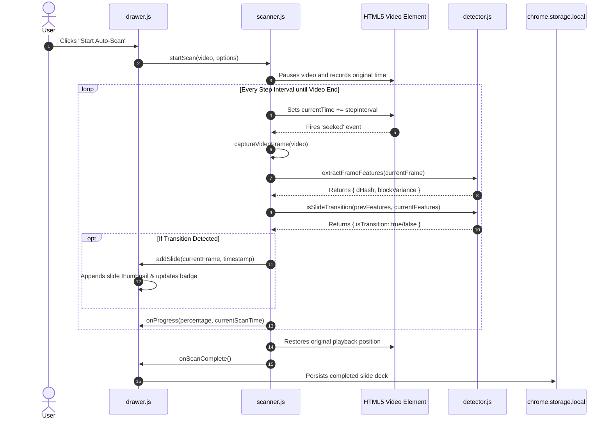
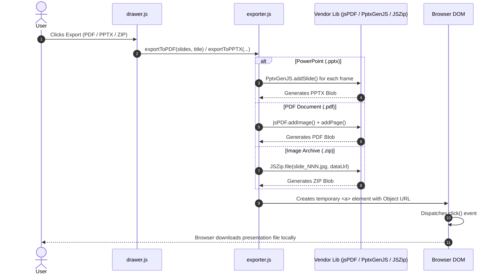

# 🏗️ Architecture & Codebase Structure Documentation

Welcome to the developer and architecture documentation for **YT to PDF**. This document provides an in-depth technical overview of the project's folder structure, architectural design, component interactions, data flows, and security model for developers and contributors.

---

## 📑 Table of Contents

1. [High-Level Architectural Overview](#1-high-level-architectural-overview)
2. [Folder & Directory Structure](#2-folder--directory-structure)
3. [Core Subsystems & Module Breakdown](#3-core-subsystems--module-breakdown)
   - [Content Script Orchestrator (`src/content/content.js`)](#content-script-orchestrator-srccontentcontentjs)
   - [Difference Hashing & Detection Engine (`src/content/detector.js`)](#difference-hashing--detection-engine-srccontentdetectorjs)
   - [Automated Video Scanner (`src/content/scanner.js`)](#automated-video-scanner-srccontentscannerjs)
   - [Interactive Slide Deck Drawer (`src/content/drawer.js`)](#interactive-slide-deck-drawer-srccontentdrawerjs)
   - [Document & Slide Exporter (`src/content/exporter.js`)](#document--slide-exporter-srccontentexporterjs)
   - [Toolbar Action Popup (`src/popup/`)](#toolbar-action-popup-srcpopup)
   - [Background Service Worker (`src/background/`)](#background-service-worker-srcbackground)
4. [Data Flows & Sequence Diagrams](#4-data-flows--sequence-diagrams)
   - [Manual Slide Snapshot Flow](#manual-slide-snapshot-flow)
   - [Automated Slide Scanner Flow](#automated-slide-scanner-flow)
   - [Slide Export Pipeline](#slide-export-pipeline)
5. [State Management & Storage Schema](#5-state-management--storage-schema)
6. [Security, Offline Isolation & Chrome Web Store Compliance](#6-security-offline-isolation--chrome-web-store-compliance)
7. [Developer & Build Workflows](#7-developer--build-workflows)

---

## 1. High-Level Architectural Overview

**YT to PDF** is architected as a **100% client-side, zero-latency Chrome Extension (Manifest V3)**. It captures presentation slides from YouTube HTML5 `<video>` elements, filters out noise (mouse pointers, speaker webcams, laser dots) using perceptual hashing and block variance, and compiles the extracted slides into **PDF**, **PowerPoint (`.pptx`)**, or **ZIP** archives directly inside the browser sandbox.

### Architecture Component Diagram

```mermaid
graph TD
    subgraph Browser Context
        subgraph Toolbar UI
            POP[Popup: src/popup/popup.html / .js]
        end

        subgraph Background Context
            SW[Service Worker: src/background/background.js]
        end

        subgraph YouTube Tab Content Script Context
            CS[Content Orchestrator: src/content/content.js]
            DET[Detector Engine: src/content/detector.js]
            SCN[Scanner Engine: src/content/scanner.js]
            DRW[Slide Drawer UI: src/content/drawer.js]
            EXP[Exporter Engine: src/content/exporter.js]
            CSS[Styles: src/styles/injected.css]
            
            subgraph Vendor Libraries (lib/)
                PDF[jsPDF: lib/jspdf.umd.min.js]
                PPT[PptxGenJS: lib/pptxgen.bundle.js]
                ZIP[JSZip: lib/jszip.min.js]
            end
        end

        subgraph YouTube Page DOM
            YDOM[YouTube Player & Controls]
            YVID[HTML5 <video> Element]
        end

        subgraph Chrome APIs
            STOR[(chrome.storage.local)]
            TABS[chrome.tabs / runtime IPC]
        end
    end

    %% Interactions
    POP -- chrome.tabs.sendMessage --> CS
    CS -- DOM Injection --> YDOM
    CS -- Seeks / Reads Frames --> YVID
    SCN -- Captures Frames to Canvas --> YVID
    SCN -- Compares Frame Hashes --> DET
    SCN -- Emits New Slide --> DRW
    CS -- Manual Snap --> DRW
    DRW -- Saves / Restores Decks --> STOR
    DRW -- Triggers Export --> EXP
    EXP -- Renders Presentation --> PPT
    EXP -- Renders Document --> PDF
    EXP -- Bundles Images --> ZIP
    EXP -- Triggers Browser Download --> BrowserContext[Client File Download]
```

---

## 2. Folder & Directory Structure

Below is the complete file and directory layout of the repository:

```
yt_to_ppt/
├── manifest.json                  # Manifest V3 extension configuration & permissions
├── package.json                   # Node package metadata, scripts, and dev dependencies
├── package-lock.json              # Locked dependency tree
├── README.md                      # End-user documentation and quick-start guide
├── ARCHITECTURE.md                # Developer documentation (this document)
├── AGENTS.md                      # Workspace agent guidelines & architecture sync rules
├── LICENSE                        # Proprietary license terms
├── troubleshooting-chrome-web-store-violations.md # CWS policy reference guide
│
├── dist/                          # Production distribution builds (.zip packages)
│   ├── yt-to-pdf-v1.0.0.zip
│   └── yt-to-pdf-v1.0.1.zip
│
├── icons/                         # Extension icons in standard resolutions
│   ├── icon16.png                 # 16x16 icon (favicon / context menus)
│   ├── icon48.png                 # 48x48 icon (extensions manager)
│   └── icon128.png                # 128x128 icon (Chrome Web Store / install dialog)
│
├── images/                        # Product screenshots & store assets
│   ├── AI Images/                 # Concept and promotional graphics
│   └── ...                        # Store showcase screenshots
│
├── lib/                           # Bundled third-party vendor dependencies (Zero CDN)
│   ├── jspdf.umd.min.js           # jsPDF library for client-side PDF document generation
│   ├── jszip.min.js               # JSZip library for image archive packaging
│   └── pptxgen.bundle.js          # PptxGenJS library for PowerPoint deck generation
│
├── scripts/                       # Developer toolchain and build automation
│   ├── audit_compliance.js        # Static analyzer auditing for Chrome Web Store policy compliance
│   ├── generate_icons.js          # Utility script to generate PNG icons via node-canvas
│   └── package.js                 # Packaging script producing clean, validated distribution zips
│
├── src/                           # Primary source code
│   ├── background/
│   │   └── background.js          # MV3 Background Service Worker lifecycle handler
│   │
│   ├── content/                   # Content scripts injected into YouTube watch pages
│   │   ├── content.js             # Content script entry point, DOM observer & event coordinator
│   │   ├── detector.js            # Difference hashing (dHash) & slide transition detection engine
│   │   ├── drawer.js              # In-page Slide Deck drawer UI & deck manager
│   │   ├── exporter.js            # Multi-format export pipeline (PPTX, PDF, ZIP, Print)
│   │   └── scanner.js             # Automated frame seeker, scanner state machine & grabber
│   │
│   ├── popup/                     # Browser action toolbar popup
│   │   ├── popup.html             # Popup structure & layout
│   │   ├── popup.css              # Popup styling & theme
│   │   └── popup.js               # Popup controller & tab IPC bridge
│   │
│   └── styles/
│       └── injected.css           # In-page styles for injected player buttons & drawer overlay
│
└── tests/                         # Algorithmic test suite
    └── detector.test.js           # Unit tests for perceptual hashing & transition detection
```

---

## 3. Core Subsystems & Module Breakdown

### Content Script Orchestrator (`src/content/content.js`)
- **Role**: Serves as the central manager running in the YouTube page context.
- **Responsibilities**:
  - **Single Injection Protection**: Guards against duplicate injection across Single Page Application (SPA) soft navigations using `window.__ytsnip_injected`.
  - **SPA Navigation Observer**: Listens to YouTube's custom navigation events (`yt-navigate-finish`) and URL changes to reload slide decks dynamically when the user changes videos without a page reload.
  - **Player Controls Injection**: Injects custom camera (Snap), flash (Auto-Scan), and deck (Slide Deck) action buttons directly into YouTube's `.ytp-right-controls` bar.
  - **Keyboard Shortcut Routing**: Listens for global hotkeys (<kbd>Alt</kbd> + <kbd>S</kbd> for Snap, <kbd>Alt</kbd> + <kbd>A</kbd> for Auto-Scan, <kbd>Alt</kbd> + <kbd>D</kbd> for Drawer).
  - **IPC Message Dispatcher**: Handles messages sent from `popup.js` (`GET_STATUS`, `SNAP_SLIDE`, `START_SCAN`, `OPEN_DRAWER`, `EXPORT_DECK`).

### Difference Hashing & Detection Engine (`src/content/detector.js`)
- **Role**: Algorithmic core responsible for detecting slide transitions while rejecting spurious noise.
- **Key Algorithms**:
  - **Luminance Normalization**: Converts RGB pixel values into grayscale luminance:
    $$\text{Luminance} = 0.299R + 0.587G + 0.114B$$
  - **64-Bit Difference Hash (`dHash`)**: Resamples video frames into a $9 \times 8$ grid and calculates gradient differences between adjacent horizontal pixels to generate a 64-bit binary fingerprint.
  - **Hamming Distance**: Fast bitwise comparison determining structural layout changes.
  - **Block-Level Color Variance ($16 \times 16$ Grid)**: Divides the frame into 256 sub-blocks, computing mean color and variance per block. This accurately identifies incremental slide changes (e.g., bullet point additions, code line appearances) while ignoring small localized movements (mouse pointers, speaker webcam gestures).
  - **Preset Sensitivity Thresholds**: Configurable `low`, `medium`, and `high` thresholds balancing precision versus recall.

### Automated Video Scanner (`src/content/scanner.js`)
- **Role**: High-speed, programmatic video seeker and automated slide extractor.
- **Key Mechanisms**:
  - **`captureVideoFrame(video, cropRect)`**: Captures the current video frame into an off-screen HTML5 `<canvas>` and produces optimized JPEG data URLs.
  - **Asynchronous Seek & Sync**: Seeks the HTML5 `<video>` element to specific timestamps and waits for `seeked` events before processing the frame.
  - **Progression State Machine**: Supports `start()`, `pause()`, `resume()`, and `stop()` with configurable sample step intervals (e.g., every 1, 2, or 5 seconds).
  - **Progress Emitter**: Dispatches real-time percentage and slide count updates to the drawer UI and popup.

### Interactive Slide Deck Drawer (`src/content/drawer.js`)
- **Role**: Rich, embedded UI allowing users to curate slides without leaving YouTube.
- **Features**:
  - **Card Grid Layout**: Visual gallery of all extracted slides displaying timestamps, slide index, and action buttons.
  - **Timestamp Navigation**: Clicking on a thumbnail jumps the YouTube video directly to that moment.
  - **Slide Deck Curation**: Delete unwanted frames, copy slide images directly to the system clipboard, or remove duplicates.
  - **Scan Controls & Preferences**: Sensitivity picker, scan step interval selector, and optional bounding-box cropping (e.g., removing speaker webcam overlays).
  - **Storage Synchronization**: Automatically persists decks to `chrome.storage.local` indexed by YouTube video ID.

### Document & Slide Exporter (`src/content/exporter.js`)
- **Role**: Assembles extracted slide decks into user-requested document formats.
- **Export Formats**:
  - **PowerPoint (`.pptx`)**: Uses `PptxGenJS` to construct a 16:9 widescreen slide deck with high-resolution slide images filling each slide canvas.
  - **PDF Document (`.pdf`)**: Uses `jsPDF` to compile a multi-page landscape PDF document matching standard presentation dimensions.
  - **Image Archive (`.zip`)**: Uses `JSZip` to bundle sequential JPEG/PNG images into a downloadable archive.
  - **Print Layout**: Dynamically generates a print-friendly document structure and invokes `window.print()` with `@media print` page-break rules.

### Toolbar Action Popup (`src/popup/`)
- **Role**: Browser extension toolbar popup interface.
- **Components**:
  - `popup.html`: Markup for status indicators, active video title, slide counter, and quick action buttons.
  - `popup.css`: Extension popup theme matching modern design standards.
  - `popup.js`: Queries the active tab, verifies YouTube watch page state, and forwards commands to `content.js` via `chrome.tabs.sendMessage`.

### Background Service Worker (`src/background/`)
- **Role**: Manifest V3 background service worker (`src/background/background.js`).
- **Functionality**: Minimal lifecycle handler for extension installation and update events.

---

## 4. Data Flows & Sequence Diagrams

### Manual Slide Snapshot Flow



---

### Automated Slide Scanner Flow



---

### Slide Export Pipeline



---

## 5. State Management & Storage Schema

Slide decks are stored locally in Chrome's sandboxed storage (`chrome.storage.local`). Each video's deck is partitioned by its unique YouTube video ID.

### Storage Key Format
```
ytsnip_deck_<VIDEO_ID>
```

### Data Schema (`SlideDeck`)
```typescript
interface SlideItem {
  id: string;              // Unique identifier (e.g. "slide_1719830000000_1")
  dataUrl: string;         // JPEG Base64 data URL (quality: 0.92)
  timestamp: number;       // Playback time in seconds (e.g. 142.5)
  formattedTime: string;   // Human-readable timestamp (e.g. "02:22")
  width: number;           // Original capture width in px
  height: number;          // Original capture height in px
  hash?: string;           // 64-bit dHash string
}

interface SlideDeckStorage {
  videoId: string;         // YouTube video ID (e.g. "dQw4w9WgXcQ")
  videoTitle: string;      // Video title string
  lastUpdated: number;     // Unix timestamp (ms)
  slides: SlideItem[];     // Array of captured slides
}
```

---

## 6. Security, Offline Isolation & Chrome Web Store Compliance

YT to PDF adheres to the strictest Google Chrome Web Store policies and privacy standards:

1. **Zero Remote Code Execution (Blue Argon Compliance)**:
   - All vendor libraries (`jsPDF`, `PptxGenJS`, `JSZip`) are bundled strictly locally inside `lib/`.
   - No `<script>` tags pointing to remote CDNs (`cdnjs`, `jsdelivr`, `unpkg`).
   - No `eval()`, `new Function()`, or dynamic script injection.
2. **Minimal Scoped Permissions**:
   - `host_permissions`: Strictly scoped to `*://*.youtube.com/*` for video frame access.
   - `permissions`: Only `storage` is requested for local deck persistence.
   - Broad permissions like `webRequest`, `<all_urls>`, `tabs`, `activeTab`, or `cookies` are intentionally avoided.
3. **100% Offline & Client-Side Privacy**:
   - Zero telemetry, analytics, tracking, or network requests to external servers.
   - All frame processing, image hashing, PDF compilation, and PPTX assembly take place entirely in-memory within the user's browser.

---

## 7. Developer & Build Workflows

### Prerequisites
- Node.js (v16.0.0 or higher)
- Google Chrome browser

### 1. Running Algorithmic Tests
The test suite validates the perceptual hashing and slide transition detection algorithms against synthetic frame scenarios (identical slides, cursor movements, laser pointers, layout changes):

```bash
npm test
```

### 2. Auditing Chrome Web Store Policy Compliance
Run the compliance static analyzer to verify that no external CDN references, dynamic script creation, or unauthorized permissions exist in the source code:

```bash
node scripts/audit_compliance.js
```

### 3. Packaging Production Release
Generates a clean `.zip` archive ready for upload to the Chrome Web Store Developer Dashboard:

```bash
npm run build
# or
npm run package
```
Output files are saved to `dist/yt-to-pdf-v<version>.zip` and `yt-to-pdf.zip`.

### 4. Loading Unpacked Extension in Chrome
1. Open Google Chrome and navigate to `chrome://extensions/`.
2. Enable **Developer mode** (top right toggle).
3. Click **Load unpacked** and select the root directory of this repository (`C:\Users\ashmi\Coding\Projects\yt_to_ppt`).
4. Navigate to any YouTube video to test features live.

---

## 📄 License & Maintainer

- **Author**: Ashmit Verma
- **License**: Proprietary / Closed-Source (Reference only)
