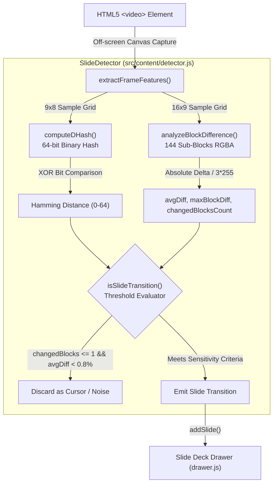

# 🔍 Difference Hashing & Detection Engine Documentation

This document provides a comprehensive technical reference for the **Difference Hashing & Detection Engine** implemented in [`src/content/detector.js`](../src/content/detector.js).

The engine is responsible for analyzing video frames captured from YouTube HTML5 player elements, detecting genuine presentation slide transitions (new slides, bullet points, code additions, diagrams), while rejecting non-slide visual noise such as mouse cursors, laser pointers, presenter webcam gestures, and video compression artifacts.

---

## 📑 Table of Contents

1. [Architectural Overview](#1-architectural-overview)
2. [Dual-Tier Detection Strategy](#2-dual-tier-detection-strategy)
3. [Mathematical Foundations & Algorithms](#3-mathematical-foundations--algorithms)
   - [Perceptual Luminance (ITU-R BT.601)](#perceptual-luminance-itu-r-bt601)
   - [Difference Hashing (dHash)](#difference-hashing-dhash)
   - [Hamming Distance Metric](#hamming-distance-metric)
   - [Block-Level Color Variance (16x9 Grid)](#block-level-color-variance-16x9-grid)
4. [Decision Logic & Sensitivity Presets](#4-decision-logic--sensitivity-presets)
   - [Sensitivity Presets](#sensitivity-presets)
   - [Noise & Cursor Rejection Heuristics](#noise--cursor-rejection-heuristics)
5. [Downsampling & Memory Performance](#5-downsampling--memory-performance)
6. [API Reference](#6-api-reference)
7. [Unit Testing & Synthetic Benchmarks](#7-unit-testing--synthetic-benchmarks)

---

## 1. Architectural Overview

During automated scanning (`src/content/scanner.js`), the extension seeks across a YouTube video at regular intervals (e.g. 1s, 2s, or 5s). For each sampled timestamp:

1. An off-screen HTML5 `<canvas>` captures the current video frame.
2. The frame features are extracted using `SlideDetector.extractFrameFeatures(source)`.
3. The detector compares the extracted features against the previously saved slide using `SlideDetector.isSlideTransition(prevFeatures, currFeatures, options)`.
4. If a transition is confirmed, the new slide is emitted to the Slide Deck Drawer (`src/content/drawer.js`) and persisted in `chrome.storage.local`.



---

## 2. Dual-Tier Detection Strategy

Slide detection in video streams faces two contradictory requirements:
1. **High Recall**: Must catch subtle, incremental slide changes (e.g., a presenter revealing a single bullet point, an extra line of code, or a formula).
2. **High Precision**: Must completely ignore mouse pointer movements, presenter webcam gestures, laser pointers, and lossy video compression noise.

Single-algorithm approaches fail in real-world scenarios:
- Relying purely on global perceptual hashing (like pHash or dHash) misses localized bullet-point reveals because small text changes on a large white slide do not alter the low-frequency structural gradients.
- Relying purely on pixel delta thresholds causes massive false positives from mouse cursors and webcam video feeds.

To solve this, `SlideDetector` combines a **dual-tier perceptual pipeline**:
- **Tier 1 (Global Structure)**: 64-bit Difference Hashing (`dHash`) tracking structural layout gradients.
- **Tier 2 (Local Spatial Variance)**: A $16 \times 9$ block grid (144 spatial blocks) tracking localized color deltas and active region counts.

---

## 3. Mathematical Foundations & Algorithms

### Perceptual Luminance (ITU-R BT.601)

Before performing gradient comparisons, color RGB pixels are converted to a scalar grayscale luminance value $Y$:

```javascript
function rgbToGray(r, g, b) {
  return 0.299 * r + 0.587 * g + 0.114 * b;
}
```

#### Why these exact coefficients?
The human eye contains three types of cone photoreceptors (S, M, and L cones), with peak photopic spectral sensitivity centered in the green spectrum ($\approx 555\text{ nm}$):
- **Green ($58.7\%$)**: Dominates human brightness perception.
- **Red ($29.9\%$)**: Moderately contributes to brightness.
- **Blue ($11.4\%$)**: Appears significantly darker under equal radiant power.

These coefficients originate from **ITU-R Recommendation BT.601** (formerly CCIR 601), standardized for studio-quality digital video and standard $Y'C_bC_r$ color spaces. 

> [!NOTE]
> Naive averaging `(R + G + B) / 3` treats blue and green identically. Under naive averaging, changing a text block from dark blue `(0, 0, 180)` to dark green `(0, 180, 0)` shows zero brightness difference, whereas human perception recognizes an immediate, distinct contrast shift.

---

### Difference Hashing (dHash)

Difference Hashing identifies structural gradients across the slide:

1. **Downsample**: The frame is resampled to a $9 \times 8$ grid ($9$ columns, $8$ rows = $72$ pixels).
2. **Compute Gradients**: For each row $y \in [0, 7]$, compare adjacent horizontal pixels $x \in [0, 7]$:
   $$\text{bit}(y, x) = \begin{cases} 1 & \text{if } Y(x, y) > Y(x + 1, y) \\ 0 & \text{otherwise} \end{cases}$$
3. **Assemble Hash**: 8 rows $\times$ 8 comparisons = **64 bits**.

```
Row 0: [P0] > [P1] ? 1 : 0 | [P1] > [P2] ? 1 : 0 | ... | [P7] > [P8] ? 1 : 0  => 8 bits
Row 1: [P0] > [P1] ? 1 : 0 | [P1] > [P2] ? 1 : 0 | ... | [P7] > [P8] ? 1 : 0  => 8 bits
...
Row 7: [P0] > [P1] ? 1 : 0 | [P1] > [P2] ? 1 : 0 | ... | [P7] > [P8] ? 1 : 0  => 8 bits
Total: 64-bit binary fingerprint string
```

#### Invariance Properties
- **Brightness & Contrast Invariance**: Because dHash computes relative differences between adjacent pixels ($P_{x} > P_{x+1}$) rather than absolute values, global brightness adjustments do not alter the hash.
- **Aspect Ratio & Scale Invariance**: Resampling to $9 \times 8$ normalizes any YouTube video resolution (480p, 720p, 1080p, 4K) into an identical coordinate space.

---

### Hamming Distance Metric

To compare two 64-bit hashes $h_1$ and $h_2$, the engine calculates the **Hamming Distance** ($D_H$), which counts the number of differing bit positions:

$$D_H(h_1, h_2) = \sum_{i=0}^{63} \left( h_1[i] \oplus h_2[i] \right)$$

- $D_H = 0$: Structurally identical frames.
- $1 \le D_H \le 2$: Micro-changes (cursor movement, compression noise).
- $D_H \ge 3$: Significant layout or structure shift.
- $D_H \ge 10$: Major full-slide template redesign.

---

### Block-Level Color Variance (16x9 Grid)

To detect text additions on static slide templates, the frame is divided into a $16 \times 9$ grid ($144$ sub-blocks), matching standard 16:9 widescreen presentation aspect ratios.

For each corresponding block $i$ between Frame A and Frame B:
$$\Delta_{\text{block}}(i) = \frac{|R_A - R_B| + |G_A - G_B| + |B_A - B_B|}{3 \times 255} \times 100\%$$

From these 144 blocks, three aggregate metrics are computed:
1. **`avgDiff`**: The mean percentage difference across all 144 blocks:
   $$\text{avgDiff} = \frac{1}{144} \sum_{i=1}^{144} \Delta_{\text{block}}(i)$$
2. **`maxBlockDiff`**: The maximum single-block percentage change:
   $$\text{maxBlockDiff} = \max_{1 \le i \le 144} \Delta_{\text{block}}(i)$$
3. **`changedBlocksCount`**: The number of blocks exhibiting active change:
   $$\text{changedBlocksCount} = \sum_{i=1}^{144} \mathbb{I}(\Delta_{\text{block}}(i) \ge 2.5\%)$$

A block threshold of **$2.5\%$** acts as a noise gate, eliminating standard YouTube H.264/VP9 compression macroblock fluttering.

---

## 4. Decision Logic & Sensitivity Presets

### Sensitivity Presets

The detector exposes three sensitivity presets configured in the slide drawer UI:

| Preset | Target Use Case | Trigger Conditions (`isSlideTransition`) |
|---|---|---|
| **`high`** | Highly detailed lectures, code walks, incremental bullet points | `avgDiff >= 1.2%` <br/>**OR** `(hamming >= 2 && changedBlocksCount >= 2)` <br/>**OR** `changedBlocksCount >= 3` |
| **`medium`** *(Default)* | Standard study presentations, balanced precision & recall | `avgDiff >= 2.0%` <br/>**OR** `(hamming >= 3 && changedBlocksCount >= 2)` <br/>**OR** `(hamming >= 2 && avgDiff >= 1.5%)` <br/>**OR** `changedBlocksCount >= 4` |
| **`low`** | Strict overview; captures major slide transitions only | `avgDiff >= 4.5%` <br/>**OR** `(hamming >= 6 && changedBlocksCount >= 6)` <br/>**OR** `changedBlocksCount >= 10` |

---

### Noise & Cursor Rejection Heuristics

A major failure mode in naive slide extractors is capturing slides every time a presenter moves the mouse pointer or uses a red laser pointer.

`SlideDetector` implements an explicit safety filter:

```javascript
// Safety filter: If only 1 single block changed and total difference is tiny (<0.8%), it's a cursor / noise
if (changedBlocksCount <= 1 && avgDiff < 0.8 && hamming <= 1) {
  isTransition = false;
}
```

#### Why this works:
1. **Mouse Cursors**: A $16 \times 16$ or $24 \times 24$ pixel mouse pointer occupying a 1080p slide covers less than $0.05\%$ of the total screen area. Even when it moves across block boundaries, it alters at most 1 block in the $16 \times 9$ grid beyond $2.5\%$, and produces an `avgDiff` typically between $0.1\%$ and $0.7\%$.
2. **Laser Pointers**: Red laser dots occupy a small radius ($\approx 4\text{px}$). They produce local color shifts but fail to cross the multi-block threshold (`changedBlocksCount >= 2`) or the structural Hamming threshold.

---

## 5. Downsampling & Memory Performance

To guarantee zero impact on YouTube video playback performance:

- **GPU Acceleration via Canvas**: In browser runtime, downsampling is delegated to Chrome's 2D canvas pipeline:
  ```javascript
  const ctx = canvas.getContext('2d', { willReadFrequently: true });
  ctx.drawImage(source, 0, 0, 16, 9);
  ```
  The `{ willReadFrequently: true }` context flag hints Chrome to retain the backing store in CPU-accessible memory, avoiding expensive GPU-to-CPU synchronization stalls during `getImageData()`.
- **Pure JavaScript Fallback**: For headless environments or Node.js test runners where DOM elements are mocked, [`downsampleImageData`](../src/content/detector.js#L81-L105) provides a ratio-based software downsampler with zero external dependencies.
- **Fixed Memory Footprint**: Feature extraction operates entirely on tiny static buffers ($9 \times 8 \times 4$ and $16 \times 9 \times 4$ bytes), requiring less than **2 KB of memory** per comparison.

---

## 6. API Reference

The `SlideDetector` module is exported as a universal UMD object (compatible with browser globals, Web Workers, and Node.js `module.exports`).

### `rgbToGray(r, g, b)`
Converts 8-bit RGB channels to perceptual grayscale luminance using ITU-R BT.601.
- **Parameters**: `r` (0-255), `g` (0-255), `b` (0-255)
- **Returns**: `number` (0 to 255)

### `computeDHash(source)`
Computes a 64-bit difference hash string.
- **Parameters**: `source` (`HTMLCanvasElement` | `HTMLVideoElement` | `ImageData` | `{ data, width, height }`)
- **Returns**: `string` (64-character string composed of `'0'` and `'1'`)

### `hammingDistance(hash1, hash2)`
Computes the Hamming Distance between two equal-length hash strings.
- **Parameters**: `hash1` (`string`), `hash2` (`string`)
- **Returns**: `number` (0 to 64)

### `analyzeBlockDifference(sampleA, sampleB)`
Performs spatial difference analysis across two $16 \times 9$ RGBA samples.
- **Parameters**: `sampleA` (`Uint8ClampedArray`), `sampleB` (`Uint8ClampedArray`)
- **Returns**:
  ```typescript
  {
    avgDiff: number;           // Mean percentage difference across 144 blocks
    maxBlockDiff: number;      // Peak single block difference (%)
    changedBlocksCount: number // Count of blocks with diff >= 2.5%
  }
  ```

### `extractFrameFeatures(source)`
Samples a frame and returns pre-computed dHash and block sample buffers for fast repeated comparisons.
- **Parameters**: `source` (`HTMLVideoElement` | `HTMLCanvasElement` | `ImageData` | Object)
- **Returns**:
  ```typescript
  {
    dHash: string;             // 64-bit binary hash
    blockData: Uint8ClampedArray // 16x9x4 RGBA buffer (576 bytes)
  }
  ```

### `isSlideTransition(prevFeatures, currFeatures, options)`
Main decision entry point determining if a frame difference represents a true slide transition.
- **Parameters**:
  - `prevFeatures` (`Object`): Feature object returned by `extractFrameFeatures`.
  - `currFeatures` (`Object`): Feature object returned by `extractFrameFeatures`.
  - `options` (`Object`, optional): `{ sensitivity?: 'low' | 'medium' | 'high' }`
- **Returns**:
  ```typescript
  {
    isTransition: boolean;     // True if a slide transition occurred
    hamming: number;          // Computed Hamming distance (0-64)
    blockDiff: number;        // Global average block diff (%)
    changedBlocksCount: number // Number of blocks exceeding 2.5% delta
  }
  ```

---

## 7. Unit Testing & Synthetic Benchmarks

Algorithmic correctness and noise rejection are verified via the Node.js test runner in [`tests/detector.test.js`](../tests/detector.test.js):

```bash
npm test
```

### Verified Test Scenarios

| Test Case | Simulated Input | Expected Output | Result |
|---|---|---|---|
| **Test 1: Identical Frames** | Two identical $160 \times 90$ solid frames | `hamming: 0`, `blockDiff: 0%`, `isTransition: false` | ✅ PASS |
| **Test 2: Moving Mouse Cursor** | $10 \times 10$ pointer moving across slide | `hamming: 0`, `blockDiff: 1.36%`, `isTransition: false` | ✅ PASS |
| **Test 3: Laser Pointer / Dot** | $4\text{px}$ red laser dot moving position | `hamming: 0`, `blockDiff: 0%`, `isTransition: false` | ✅ PASS |
| **Test 4: Genuine Slide Transition** | Dark theme layout switching to light layout | `hamming: 6`, `blockDiff: 69.21%`, `isTransition: true` | ✅ PASS |
| **Test 5: Content Addition** | Slide adding major new diagram block (30% area) | `hamming: 4`, `blockDiff: 27.44%`, `isTransition: true` | ✅ PASS |
| **Test 6: Subtle Template Step** | New equation/bullet lines added to existing slide | `hamming: 2`, `blockDiff: 9.68%`, `isTransition: true` | ✅ PASS |
